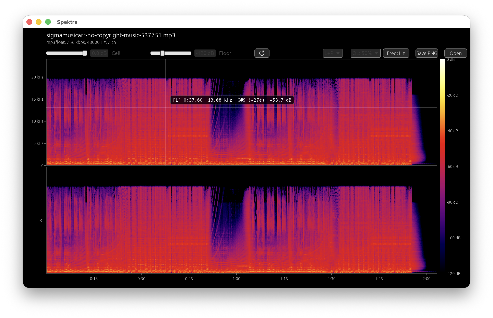

# Spektra

以 Rust 與 [egui](https://github.com/emilk/egui) 打造的桌面音訊頻譜分析工具。



**[English →](README.md)**

---

## 功能特色

- **拖放**或點擊 **Open** 按鈕載入音訊檔案
- 支援格式：MP3、WAV、FLAC、OGG、M4A、AAC、Opus、WMA、AIFF、AU
- **線性 / 對數**頻率軸切換
- **dB 範圍滑桿** — 可調整 Ceil（上限）與 Floor（下限），附重設按鈕
- **重疊率設定** — FFT 視窗重疊率：0%、50% 或 75%
- **聲道模式** — Mix（混合）、L、R 或 L+R 上下分割顯示
- **懸停資訊** — 游標位置顯示時間、頻率、最近音符名稱與 dB 值
- **匯出 PNG** — 1400 × 800 頻譜圖（Cmd/Ctrl+S 或點擊 Save PNG 按鈕）
- SoX 風格色彩調色盤

---

## 下載安裝

macOS（Apple Silicon）與 Windows（x64）的預編譯執行檔可從 [Releases](../../releases) 頁面下載。

---

## 從原始碼編譯

### 前置需求

- [Rust](https://rustup.rs/) stable 工具鏈
- FFmpeg 函式庫

**macOS（Homebrew）**

```sh
brew install ffmpeg lame x264 x265 svt-av1 dav1d opus libvpx libvmaf
cargo build --release
```

**Windows（vcpkg）**

```powershell
vcpkg install ffmpeg:x64-windows-static
$env:FFMPEG_DIR = "$env:VCPKG_INSTALLATION_ROOT\installed\x64-windows-static"
cargo build --release
```

編譯完成後，執行檔位於 `target/release/spektra`（Windows 為 `spektra.exe`）。

---

## 使用方式

| 操作 | 方法 |
|------|------|
| 開啟檔案 | 將音訊檔拖放至視窗，或點擊 **Open** |
| 儲存 PNG | 按 **Cmd/Ctrl+S**，或點擊 **Save PNG** |
| 切換頻率刻度 | 點擊 **Freq: Lin / Freq: Log** |
| 調整 dB 範圍 | 拖移 **Ceil** 與 **Floor** 滑桿 |
| 重設 dB 範圍 | 點擊 **↺** 按鈕 |
| 變更重疊率 | 從 **OL** 下拉選單選擇 |
| 切換聲道 | 從 **Mix / L+R / L / R** 下拉選單選擇 |

將游標移至頻譜圖上，可即時查看十字準線標示的時間、頻率、音符名稱與 dB 值。

---

## 技術規格

| 參數 | 數值 |
|------|------|
| FFT 大小 | 2048 點 |
| 視窗函數 | Hann |
| 頻率頻帶數 | 1025 |
| 時間欄位數 | 800 |
| 色彩調色盤 | SoX 風格 |
| 匯出解析度 | 1400 × 800 像素 |

音訊解碼採用 [ffmpeg-next](https://crates.io/crates/ffmpeg-next)；單聲道檔案會在內部自動轉為雙聲道處理。

---

## 授權

MIT
